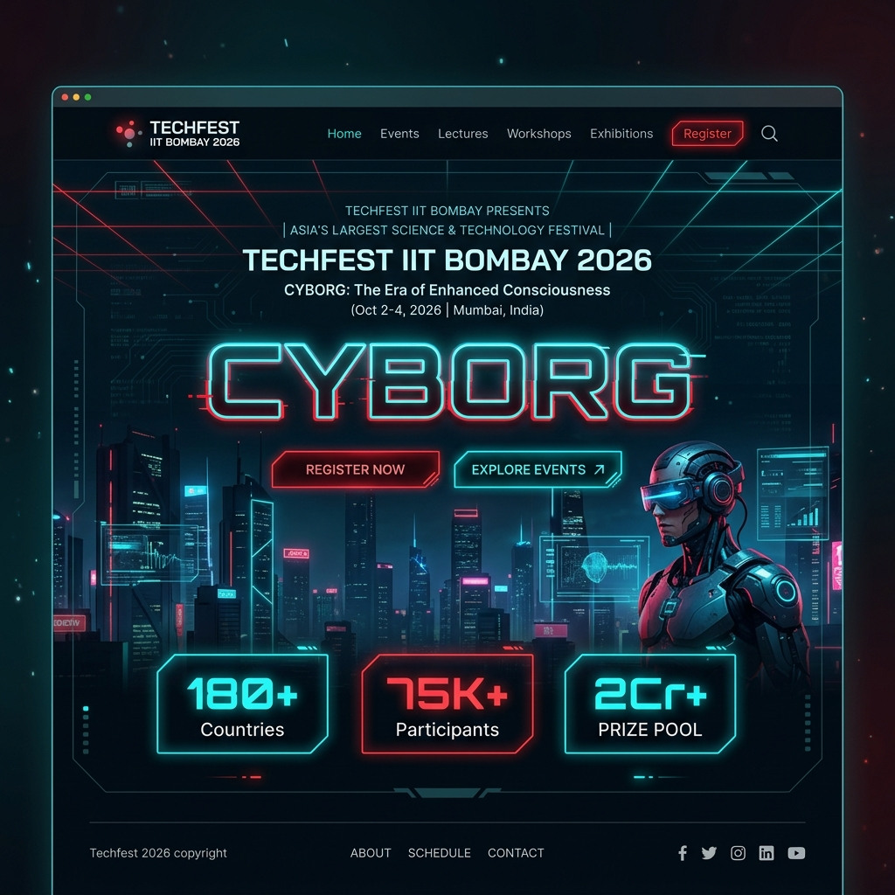

# Techfest IIT Bombay 2026 — CYBORG

Welcome to the official repository for the **Techfest IIT Bombay 2026** landing page, themed around **CYBORG: Where Human Intelligence Merges with Machine Precision**. 

As Asia's largest science and technology festival, this website showcases a high-fidelity, premium interactive experience that captures the cyberpunk, futuristic aesthetic of cybernetics, neural augmentation, and deep technology.

---

## 🖥️ Live Preview



---

## ⚡ Key Features

- **Cybernetic Theme & Aesthetics**: Custom-tailored, sleek dark mode palette with vibrant neon cyan (`#00f5ff`) and red (`#ff2d55`) accents, complete with glassmorphism overlays and scanline CRT grid textures.
- **Micro-Animations & Physics**:
  - **Dynamic Interactive Cursor**: Features a dual-element custom neon pointer and secondary elastic lag ring that scales and changes color dynamically upon hovering over interactive components.
  - **Ambient Particle Fields**: Canvas-like HTML/CSS particle emitter generating floating cyber-dust in the background.
  - **Circuit Mesh Decor**: Styled vector circuitry paths framing the viewport.
- **Event Scheduling Hub**: An interactive timeline panel loaded with chronological events for Days 1, 2, and 3, complete with category tags (Keynote, Workshop, Competition) and transition animations.
- **Key Competitions Showcase**: Glassmorphism cards for iconic flagship events, including:
  - *Robowar 2026*
  - *Neural Hackathon* (48h BCI Sprint)
  - *ExoSprint* (Biomechanical Limb Design)
  - *Skynet Racing* (FPV Drone Obstacle)
  - *CyberMorph* (Speculative Augmentation Design)
  - *Q-Circuit* (Quantum Optimization)
- **Real-Time Countdown**: Live JavaScript-powered ticker counting down down to the millisecond until the opening ceremony on January 15, 2026.
- **Modern Typography**: Structured hierarchical design utilizing modern premium typefaces *Orbitron*, *Share Tech Mono*, and *Rajdhani*.
- **Mobile-Responsive Optimization**: Adaptive layouts engineered to provide a seamless high-performance experience from widescreen desktops down to mobile viewports.

---

## 🛠️ Technology Stack

- **Markup**: Semantic HTML5 structures.
- **Styling**: Vanilla CSS3 using custom properties (design tokens), absolute flexbox/grid layouts, SVG masking, and complex keyframe animations.
- **Interactivity**: Lightweight Vanilla JavaScript ES6+ managing custom particle simulation, interactive schedules, active cursor states, and localized countdown timing.
- **Fonts**: Curated typography via Google Fonts API.

---

## 🚀 Getting Started

To view and run the landing page locally:

### Prerequisites
All you need is a modern web browser (Google Chrome, Firefox, Safari, or Microsoft Edge).

### Running Locally
1. Clone the repository:
   ```bash
   git clone https://github.com/priya05-git/Techfest-IIT-Bombay.git
   ```
2. Open the project folder:
   ```bash
   cd Techfest-IIT-Bombay
   ```
3. Open `index.html` in your favorite web browser or start a local server (e.g., using VS Code Live Server or Python):
   ```bash
   # Using Python 3
   python -m http.server 8000
   ```
   Then navigate to `http://localhost:8000`.

---

## 📂 Directory Structure

```text
Techfest-IIT-Bombay/
├── assets/
│   └── landing_page_sample.png  # Website preview screenshot
├── index.html                   # Main entrypoint containing site markup, styles, and scripts
└── README.md                    # Project overview and instructions
```

---

## 🏛️ About Techfest IIT Bombay
Established in 1998, Techfest is the annual science and technology festival of the Indian Institute of Technology, Bombay. It serves as a platform for students and tech enthusiasts worldwide to showcase their skills, engage with cutting-edge innovations, and learn from global industry leaders.
